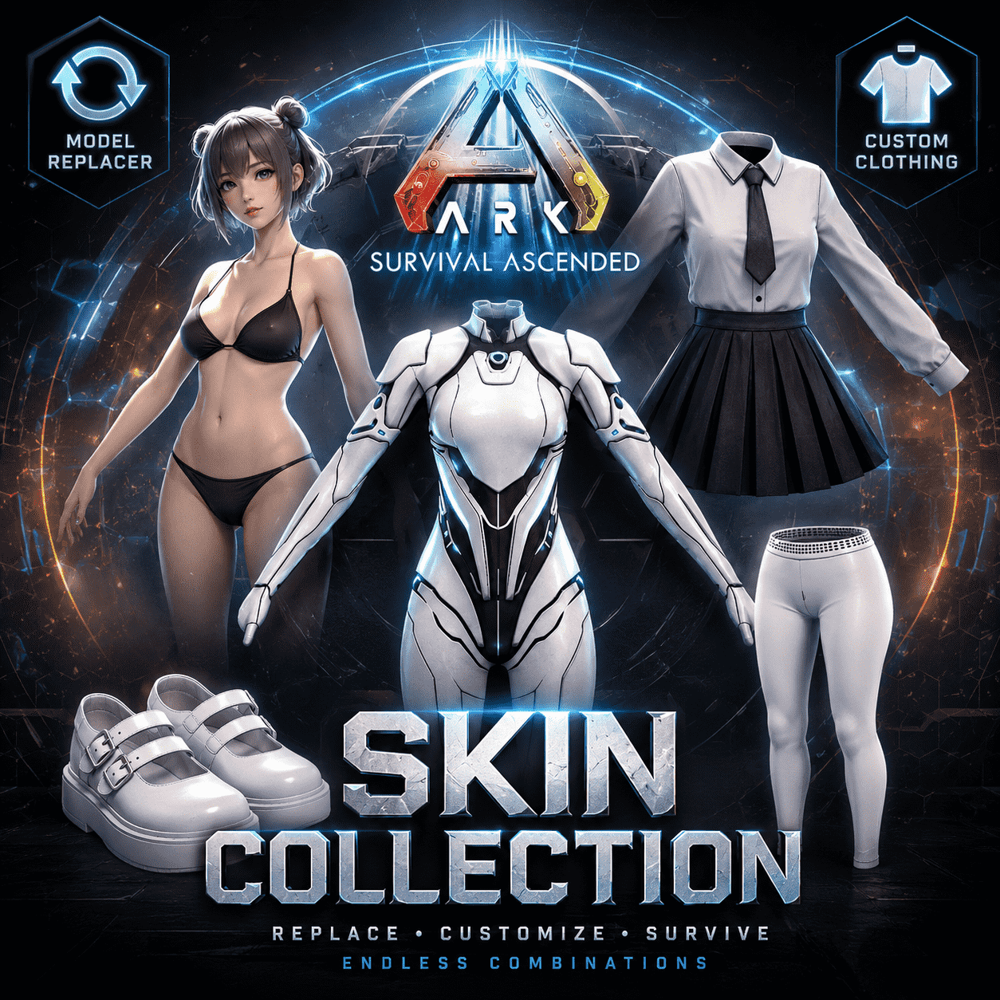
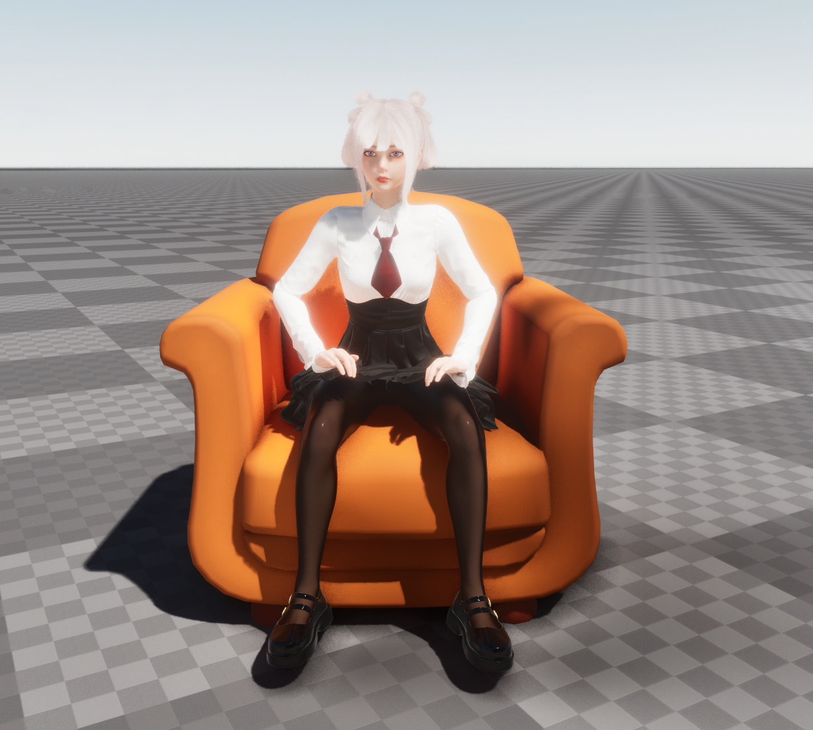

---
title: 方舟生存飞升都市时尚化妆品
published: 2026-06-24
description: 这是一款面向方舟生存飞升的角色皮肤化妆品 MOD，支持替换官方角色模型，并通过自定义穿戴衣服组合出不同风格的外观。
image: ./cover.png
tags: [ASA, MOD, 化妆品, 角色皮肤]
category: 方舟模组
draft: false
---

# 方舟生存飞升角色皮肤化妆品 MOD：让幸存者拥有更多外观可能

在《方舟：生存飞升》（ARK: Survival Ascended）里，角色外观一直是很多玩家非常在意的一部分。比起只更换一件装备或一套护甲，我更希望玩家能拥有一种更自由的外观体验：不仅可以替换官方角色模型，还能继续通过衣服、鞋子、装饰件等内容进行自定义搭配。

这款化妆品 MOD 就是围绕这个方向制作的。它的核心内容是各种各样的角色皮肤，让玩家可以把原本的官方幸存者模型替换成新的角色形象，并在此基础上继续穿戴不同衣服，组合出更符合自己喜好的造型。

<iframe src="https://player.bilibili.com/player.html?bvid=BV1YYJN69E87&page=1" scrolling="no" border="0" frameborder="no" framespacing="0" allowfullscreen="true" style="width: 100%; height: 450px; border-radius: 8px; box-shadow: 0 4px 10px rgba(0,0,0,0.15);"></iframe>

> 演示视频：[【方舟生存飞升模组】简单水一下](https://www.bilibili.com/video/BV1YYJN69E87/?share_source=copy_web&vd_source=56fa13e5906bda47c97c1104352b7bfb)

## MOD 主要内容

这款 MOD 的定位是角色皮肤与服装自定义集合，主要包含以下几个方向：

- **角色模型替换**：穿戴对应化妆品后，可以将官方幸存者模型替换为新的角色模型。
- **多种角色皮肤**：提供不同风格的角色外观，让玩家可以根据自己的喜好选择形象。
- **自定义穿搭**：在替换角色模型后，仍然可以通过衣服、鞋子等部件继续搭配外观。
- **化妆品系统兼容**：作为 ASA 的化妆品 MOD，主要用于外观展示，不改变核心生存玩法。
- **更自由的角色表达**：比单纯换一套衣服更进一步，让角色本体和服装搭配都能被定制。

简单来说，它不是只给角色加一件装备，而是给玩家一个新的外观框架：你可以先选择想要的角色形象，再继续为这个角色搭配不同衣服。

## 替换官方模型：从幸存者到角色皮肤

传统装备外观通常只是覆盖在官方幸存者身体上，角色比例和身体结构仍然受原模型影响。这个 MOD 的重点则是“模型替换”：玩家穿戴皮肤后，角色会以新的模型形象呈现。

这种方式的好处是外观表现更统一，也更适合制作风格化角色。无论是偏动漫风格、幻想风格，还是更接近展示型角色皮肤，都可以通过独立模型获得更完整的视觉效果。

对于喜欢拍照、录视频、搭建展示场景，或者想让自己的角色在服务器里更有辨识度的玩家来说，这类模型替换皮肤会比普通装备外观更直观。

## 自定义穿戴衣服：不是固定一套造型

这个 MOD 的另一个重点是自定义穿搭。角色模型替换后，并不意味着玩家只能使用一套固定外观。你依然可以继续搭配不同的衣服部件，让同一个角色呈现出不同风格。

比如同一个角色模型，可以根据搭配方向变成：

- 日常风格
- 校服风格
- 战斗风格
- 展示拍照风格
- 服务器活动或主题场景专用造型

这种设计让皮肤不只是一次性外观，而是可以长期搭配、反复调整的角色系统。对于喜欢折腾外观的玩家来说，可玩性会更高。

## 适合哪些玩家

如果你符合下面任意一种情况，那么这类化妆品 MOD 会很适合你：

- 想让 ASA 角色看起来更特别，不想一直使用官方幸存者模型。
- 喜欢二次元、幻想风格或风格化角色皮肤。
- 想在游戏里拍照、录制展示视频，或者制作 MOD 展示内容。
- 希望外观可以继续搭配衣服，而不是只能使用固定皮肤。
- 想给自己的服务器、部落或个人角色做出更明显的辨识度。

## 使用方式

这是方舟生存飞升的化妆品 MOD。一般情况下，在游戏内 MOD 浏览器下载并启用后，就可以在化妆品相关界面中找到对应外观内容。

安装后，你可以根据自己的需求选择角色皮肤，并继续搭配衣服部件。部分模型或服装第一次加载时可能需要一点时间，尤其是在资源较多或设备性能较低的情况下，请耐心等待加载完成。

## 获取方式

想要获取这款 MOD 的玩家，可以通过爱发电赞助 **「全新都市时尚自定义化妆品」** 方案获取，赞助金额为 **10 元/月**。

赞助后即可获得我制作的可自定义角色和穿搭的化妆品内容，并解锁高级版功能。

> 爱发电主页：[Lena_Bai](https://www.ifdian.net/a/Lena_Bai)
## 制作方向

后续这类 MOD 会继续围绕“角色皮肤 + 自定义穿搭”扩展，重点会放在以下几个方面：

- 增加更多角色皮肤。
- 优化不同衣服部件之间的搭配效果。
- 调整模型显示、材质和细节表现。
- 改善不同动作、坐姿、骑乘或场景下的外观兼容性。
- 让玩家能组合出更多属于自己的角色造型。

## 总结

这款方舟生存飞升化妆品 MOD 的核心目标很简单：让玩家不再只局限于官方角色模型，而是可以使用更多角色皮肤，并通过自定义穿戴衣服打造属于自己的幸存者外观。

如果你喜欢角色皮肤、外观搭配、拍照展示，或者只是想让自己的角色在方舟世界里更特别一点，可以试试看这个 MOD。希望它能给你的 ASA 冒险带来更多新鲜感，也让你的幸存者拥有更多表达自己的方式。

